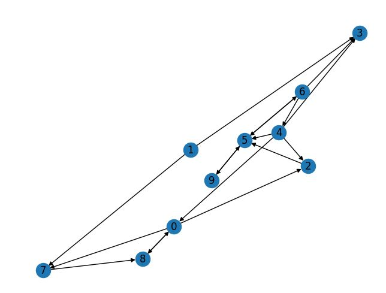

# Graph_embedding

This is a toy project with a Python implementation of the graph embedding algorithm Deepwalk using networkx for graph generation.

------ ENTER MORE TEXT -----------

We use networkx to create a directed graph as shown below:

-------- USE CSS AND HTML TO BEAUTIFY README -----------

Next, we perform multiple random walks in the graph and use Word2Vec from gensim to create a graph embedding.

-------- INSERT IMAGE OF NODE EMBEDDING --------

Discuss entering node to check for similarity

-------- INSERT IMAGE OF PROMPT -------

Discuss further ideas:

- alteration to graph and compare embeddings / distance
- use alternative to Word2Vec / algorithm from scratch
- improve random walk somehow?
- use deepwalk in graph with real-world data in separate file (similarity interesting)
- use embedding in ML task
- comparison to DeepWalk implementation from Karateclub in separate file
