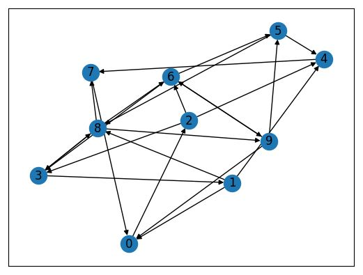

# Graph_embedding


This is a toy project with a Python implementation of the graph embedding algorithm Deepwalk using networkx for graph generation.

We use networkx to create a directed graph as shown below:



Next, we perform multiple random walks in the graph as illustrated in the following examples of length 10:

```
[4, 7, 0, 2, 3, 1, 4, 7, 0, 2, 4]
[1, 4, 7, 0, 2, 6, 5, 8, 9, 0, 2]
[5, 4, 7, 0, 2, 6, 9, 6, 5, 8, 7]
[1, 0, 2, 3, 8, 3, 8, 7, 0, 2, 6]
[3, 1, 8, 3, 8, 3, 1, 8, 6, 5, 8]
```

Then we use Word2Vec from gensim to create a graph embedding. The embedding for the corresponding nodes is shown below:

```
Node  0: [-0.99428976  0.558415]
Node  1: [-0.6456272   0.9415462]
Node  2: [-1.2687802   0.2808751]
Node  3: [-0.3883962   1.2181263]
Node  4: [-1.0587678   0.47976947]
Node  5: [-0.640252    0.9640195]
Node  6: [-0.7486268   0.8532258]
Node  7: [-0.729544    0.85721326]
Node  8: [-0.60102385  1.0025715]
Node  9: [-1.1867672   0.3772471]
```

Discuss entering node to check for similarity

-------- INSERT IMAGE OF PROMPT -------

Discuss further ideas:

- alteration to graph and compare embeddings / distance
- use alternative to Word2Vec / algorithm from scratch (G4G)
- improve random walk
- use deepwalk in graph with real-world data in separate file (similarity interesting)
- use embedding in ML task
- comparison to DeepWalk implementation from Karateclub in separate file
